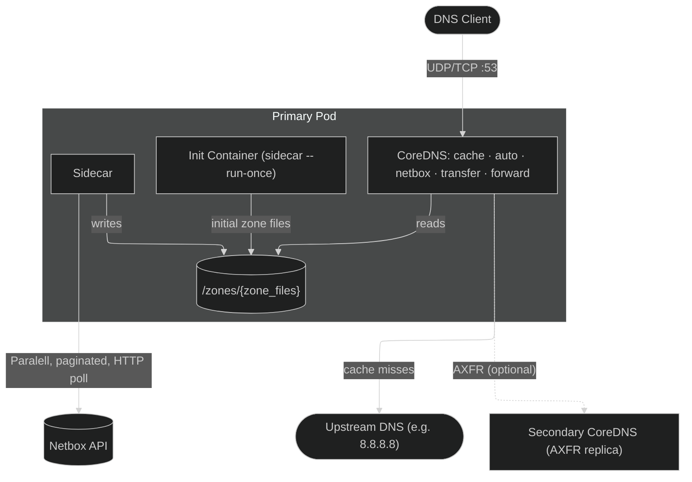

# CoreDNS with Netbox-backed Zone Discovery and AXFR Transfers

[](https://github.com/pallotron/coredns-netbox/actions/workflows/ci.yaml)
[](https://github.com/pallotron/coredns-netbox/actions/workflows/publish.yaml)
[](LICENSE)
[](go.mod)
[](https://github.com/pallotron/coredns-netbox/pkgs/container/coredns-netbox)
[](https://github.com/pallotron/coredns-netbox/pkgs/container/coredns-netbox-sidecar)

A Helm chart deploying CoreDNS with Netbox-backed DNS zones. A Go sidecar periodically scrapes Netbox for IP addresses, auto-discovers zones from device names, intelligently selects management and BMC IPs using configurable patterns, and writes zone files to a shared volume. CoreDNS serves the zone files using the `auto` plugin and optionally falls through to the [netbox plugin](https://github.com/oz123/coredns-netbox-plugin) for records not yet in the zone files. Zone transfers (AXFR) are supported for replicating zones to secondary DNS servers.

**Key Features:**
- **Smart Interface Categorization**: Automatically identifies BMC, management, loopback, and dataplane interfaces using regex patterns
- **Device-Based Discovery**: Creates DNS records from device names even when `dns_name` is empty in Netbox
- **Multi-IP Support**: Generates both primary management records and BMC records with `-bmc` suffix
- **Flexible Zone Extraction**: Derives DNS zones from device naming conventions (e.g., `dc1-site13a-r101-hv-01` → `dc1-site.example.com`)
- **Reverse DNS (PTR) Records**: Automatically generates reverse zones (in-addr.arpa, ip6.arpa) with configurable prefix lengths

## Architecture



**Request flow (primary):** cache → auto (local zone files) → netbox (optional API fallthrough) → forward (upstream)

The sidecar polls Netbox on a configurable interval, fetches all active IP addresses with DNS names using parallel paginated requests, auto-discovers zones (by FQDN depth, common suffix, or Netbox DNS plugin), and atomically writes zone files. CoreDNS detects changes via SOA serial increments.

### Performance

The sidecar uses parallel paginated HTTP requests to fetch records from Netbox. With 18,000 IP addresses (6,000 hosts across 3 data centers, each with 3 interfaces), the sidecar fetches all records in 4-8 seconds and writes 3 zone files with 6,000 records each.
## How It Works

1. **Init container** runs the sidecar with `--run-once` to generate initial zone files before CoreDNS starts
2. **Sidecar** continuously polls Netbox for all active IP addresses:
   - Fetches device information, interface names, VRFs, and IP addresses
   - Categorizes interfaces using regex patterns (BMC, management, loopback, dataplane)
   - Groups IPs by device and selects the best management IP (prefers VRF-based over interface name)
   - Extracts DNS zones from device names (e.g., `dc1-site13a-r101-hv-01` → `dc1-site.example.com`)
   - Generates DNS records: `{device}.{zone}` for management, `{device}-bmc.{zone}` for BMC
   - Generates reverse zones (in-addr.arpa, ip6.arpa) with PTR records mapping IPs back to hostnames
   - Atomically writes zone files only when changes are detected
3. **CoreDNS** serves DNS using local zone files via the `auto` plugin, with optional fallthrough to the netbox plugin for cache misses
4. **CoreDNS `auto` plugin** watches the zone directory and auto-loads new or changed zone files (every 10s)
5. Queries for names outside discovered zones are forwarded to upstream resolvers
6. If zone transfers are configured, the primary notifies secondaries on zone changes and serves AXFR requests

## Testing locally with k3d

Before deploying, use the analyzer tool to preview what DNS records will be generated:

```bash
brew install k3d helm kubectl
```

### Quick Start

Spin up a full local dev environment (k3d cluster + Netbox + seed data + CoreDNS):

```bash
make dev
```

Then test:

```bash
# Forward lookups (use +tcp for macOS, see note below)
dig @127.0.0.1 -p 15353 +tcp server1-mgmt.dc1.mycompany.com A
dig @127.0.0.1 -p 15353 +tcp server500-bmc.dc2.mycompany.com A
dig @127.0.0.1 -p 15353 +tcp google.com A  # forwarded

# Reverse lookups (PTR records)
dig @127.0.0.1 -p 15353 +tcp -x 10.1.0.1
dig @127.0.0.1 -p 15353 +tcp -x 10.2.8.244

# Secondary
dig @127.0.0.1 -p 15354 +tcp server1-mgmt.dc1.mycompany.com A
```

**Note for macOS users:** Docker Desktop on macOS has a known limitation with UDP port forwarding between the host and containers. DNS queries via UDP will timeout when querying from your Mac host to the k3d cluster. Use the `+tcp` flag with dig to force TCP queries, which work correctly. This limitation does not affect:
- DNS queries inside the Kubernetes cluster (both TCP and UDP work)
- Production deployments on real Kubernetes clusters
- Linux users (Docker on Linux handles UDP correctly)

If you need UDP for testing, run queries from inside a pod:
```bash
kubectl run -n coredns-netbox dnstest --rm -it --image=busybox -- /bin/sh
# Inside the pod:
nslookup server1-mgmt.dc1.mycompany.com 10.43.100.53  # UDP works fine
```

## Project Structure

```
├── cmd/
│   ├── analyzer/main.go          # CLI tool: analyze Netbox data & preview DNS records
│   └── sidecar/main.go           # Sidecar: poll Netbox → write zone files
├── internal/
│   ├── config/                   # Env var configuration + categorization patterns
│   ├── ipcategorizer/            # Interface categorization & device IP selection
│   ├── netboxclient/             # Raw HTTP client for Netbox IPAM with parallel pagination
│   ├── zonediscovery/            # Zone auto-discovery (zone-depth, common-suffix, netbox-dns)
│   ├── zonegen/                  # Zone file generator (atomic writes, SOA serial)
│   └── zonemanager/              # Multi-zone lifecycle (create/update/remove zone files)
├── coredns/
│   ├── Dockerfile                # CoreDNS with netbox plugin
│   └── plugin.cfg                # Plugin ordering
├── docker/sidecar/Dockerfile     # Sidecar image
├── helm/coredns-netbox/          # Helm chart
├── scripts/                      # Utility scripts (fetch Netbox data)
├── dev/                          # k3d + Netbox dev config + seed scripts
└── tests/e2e/                    # DNS resolution tests
```

## More Documentation

| Page | Description |
|---|---|
| [Configuration](docs/configuration.md) | Interface categorization, reverse DNS, Helm values, env vars, zone discovery modes |
| [Deployment](docs/deployment.md) | Production install, zone transfers, external secondaries |
| [Observability](docs/observability.md) | Prometheus metrics reference |
| [Development](docs/development.md) | Prerequisites, quick start, project structure, Makefile targets, step-by-step setup, seed data |
| [Analyzer CLI](cmd/analyzer/README.md) | Analyze Netbox data and preview DNS records before deploying |
