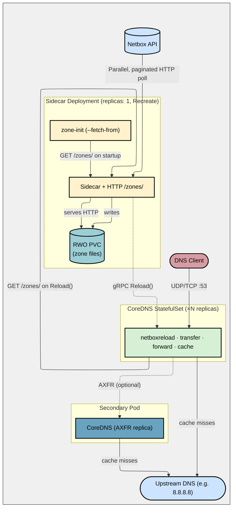

# CoreDNS with Netbox-backed Zone Discovery and AXFR Transfers

[](https://github.com/pallotron/coredns-netbox/actions/workflows/ci.yaml)
[](https://github.com/pallotron/coredns-netbox/actions/workflows/publish.yaml)
[](LICENSE)
[](go.mod)
[](https://github.com/pallotron/coredns-netbox/pkgs/container/coredns-netbox)
[](https://github.com/pallotron/coredns-netbox/pkgs/container/coredns-netbox-sidecar)

A Helm chart deploying CoreDNS with Netbox-backed DNS zones. A Go sidecar periodically scrapes Netbox for IP addresses, auto-discovers zones from device names, intelligently selects management and BMC IPs using configurable patterns, and writes zone files to its own persistent volume. Zone files are served to CoreDNS replicas over HTTP — no shared storage required. CoreDNS serves DNS using the custom `netboxreload` plugin and is notified immediately via gRPC after each zone write. Zone transfers (AXFR) are supported for replicating zones to secondary DNS servers.

**Key Features:**
- **Smart Interface Categorization**: Automatically identifies BMC, management, loopback, and dataplane interfaces using regex patterns
- **Device-Based Discovery**: Creates DNS records from device names even when `dns_name` is empty in Netbox
- **Multi-IP Support**: Generates both primary management records and BMC records with `-bmc` suffix
- **Flexible Zone Extraction**: Derives DNS zones from device naming conventions (e.g., `dc1-site13a-r101-hv-01` → `dc1-site.example.com`)
- **Reverse DNS (PTR) Records**: Automatically generates reverse zones (in-addr.arpa, ip6.arpa) with configurable prefix lengths
- **Zero-downtime deploys**: Multiple CoreDNS replicas with a standalone sidecar — DNS never goes down during a rollout
- **No shared storage**: Zone files are served via HTTP from the sidecar's own RWO PVC — no NFS, Filestore, or RWX storage needed
- **Instant zone propagation**: gRPC `Reload()` notifies all CoreDNS replicas immediately after each zone write; a configurable fallback poll (default 60s) covers gRPC delivery failures

## Architecture



The sidecar runs as a standalone Deployment (one replica, `Recreate` strategy) with its own RWO PVC. It polls Netbox, writes zone files to its PVC, and serves them over HTTP on port 8082 (`GET /zones/`). After each write it calls `ZoneReloadService.Reload()` on every CoreDNS pod — each pod fetches the fresh zone files over HTTP and swaps them into memory. A fallback poll loop inside each CoreDNS pod (default 60s) covers gRPC delivery failures. No shared or RWX storage is required.

### Performance

With 18,000 IP addresses (6,000 hosts × 3 data centers × 3 interfaces each), the sidecar fetches all records in 4–8 seconds and writes 2 zone files with ~18,000 records each. Zone propagation to all CoreDNS replicas takes under 100ms after the write completes.

## How It Works

1. **Init container** (`zone-init`) uses `--fetch-from http://<sidecar>:8082` to wait for the sidecar to be ready, then fetches all zone files over HTTP and writes them to a local emptyDir before CoreDNS starts
2. **Sidecar** continuously polls Netbox for all active IP addresses:
   - Fetches device information, interface names, VRFs, and IP addresses
   - Categorizes interfaces using regex patterns (BMC, management, loopback, dataplane)
   - Groups IPs by device and selects the best management IP
   - Extracts DNS zones from device names (e.g., `dc1-site13a-r101-hv-01` → `dc1-site.example.com`)
   - Generates DNS records: `{device}.{zone}` for management, `{device}-bmc.{zone}` for BMC
   - Generates reverse zones (in-addr.arpa, ip6.arpa) with PTR records
   - Atomically writes zone files **only when content changes** (SOA serial incremented on write)
   - After a successful write, calls `ZoneReloadService.Reload()` on each CoreDNS pod in parallel
3. **CoreDNS** serves DNS from in-memory zones loaded by the `netboxreload` plugin. On `Reload()` the plugin fetches fresh zone files from the sidecar HTTP endpoint and swaps them into memory atomically. A fallback poll (configurable, default 60s) covers gRPC delivery failures.
4. Queries for names outside discovered zones are forwarded to upstream resolvers
5. If zone transfers are configured, CoreDNS serves AXFR requests to secondary DNS servers

## Testing locally with k3d

Before deploying, use the analyzer tool to preview what DNS records will be generated:

```bash
brew install k3d helm kubectl
```

### Quick Start

Spin up a full local dev environment (k3d cluster + Netbox + seed data + CoreDNS with 2 replicas + standalone sidecar):

```bash
make dev
```

Then test:

```bash
# Forward lookups (use +tcp for macOS, see note below)
dig @127.0.0.1 -p 15353 +tcp server1-mgmt.dc1.mycompany.com A
dig @127.0.0.1 -p 15353 +tcp server500-bmc.dc2.mycompany.com A
dig @127.0.0.1 -p 15353 +tcp google.com A  # forwarded

# Reverse lookups (PTR records)
dig @127.0.0.1 -p 15353 +tcp -x 10.1.0.1

# Secondary (verifies AXFR completed)
dig @127.0.0.1 -p 15354 +tcp server1-mgmt.dc1.mycompany.com A

# Zone transfer
dig @127.0.0.1 -p 15353 +tcp AXFR mycompany.com
```

**Note for macOS users:** Docker Desktop on macOS has a known limitation with UDP port forwarding between the host and containers. Use the `+tcp` flag with dig to force TCP queries. This limitation does not affect:
- DNS queries inside the Kubernetes cluster (both TCP and UDP work)
- Production deployments on real Kubernetes clusters
- Linux users (Docker on Linux handles UDP correctly)

## Project Structure

```
├── cmd/
│   ├── analyzer/main.go          # CLI tool: analyze Netbox data & preview DNS records
│   └── sidecar/main.go           # Sidecar: poll Netbox → write zones → serve via HTTP → notify CoreDNS
├── internal/
│   ├── config/                   # Env var configuration + categorization patterns
│   ├── ipcategorizer/            # Interface categorization & device IP selection
│   ├── netboxclient/             # Raw HTTP client for Netbox IPAM with parallel pagination
│   ├── reloader/                 # gRPC client: fans out ZoneReloadService.Reload() to all pods
│   ├── zonediscovery/            # Zone auto-discovery (zone-depth, common-suffix, netbox-dns)
│   ├── zonefetch/                # HTTP client: fetches zone files from sidecar /zones/ endpoint
│   ├── zonegen/                  # Zone file generator (atomic writes, SOA serial)
│   ├── zonemanager/              # Multi-zone lifecycle (create/update/remove zone files)
│   └── zoneserver/               # HTTP handler: serves zone files from sidecar on /zones/
├── coredns/
│   ├── Dockerfile                # CoreDNS image (standard plugins + netboxreload)
│   ├── plugin.cfg                # Plugin ordering (netboxreload before auto)
│   └── plugins/netboxreload/     # Custom CoreDNS plugin: in-memory zone serving + gRPC + HTTP fetch
├── docker/sidecar/Dockerfile     # Sidecar image
├── helm/coredns-netbox/          # Helm chart
├── dev/                          # k3d + Netbox dev config + seed scripts
└── tests/e2e/                    # DNS resolution + gRPC tests
```

## More Documentation

| Page | Description |
|---|---|
| [Configuration](docs/configuration.md) | Interface categorization, reverse DNS, Helm values, env vars, zone discovery modes |
| [Deployment](docs/deployment.md) | Production install, HA setup, zone transfers, external secondaries |
| [gRPC API](docs/grpc-api.md) | Dynamic record injection, force poll/merge, zone reload, conflict handling |
| [Observability](docs/observability.md) | Prometheus metrics reference |
| [Development](docs/development.md) | Prerequisites, quick start, project structure, Makefile targets |
| [Analyzer CLI](cmd/analyzer/README.md) | Analyze Netbox data and preview DNS records before deploying |
